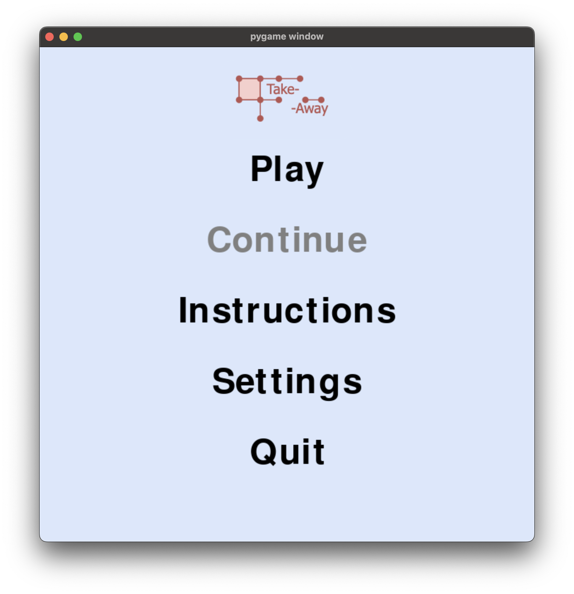
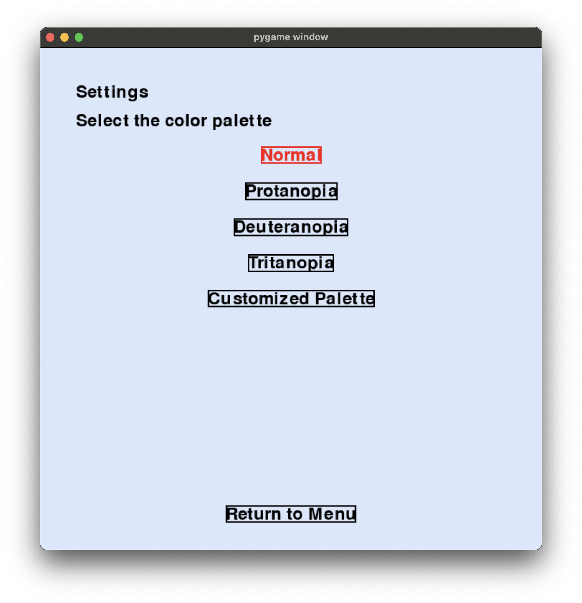
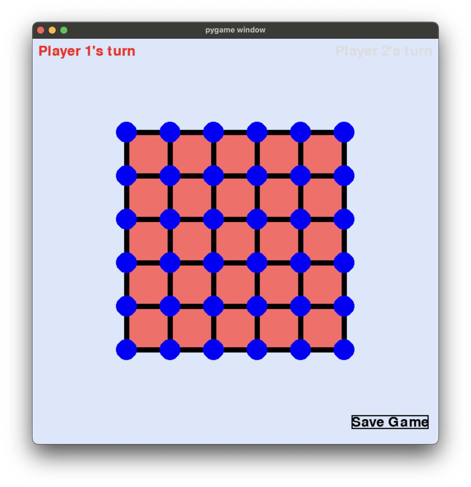
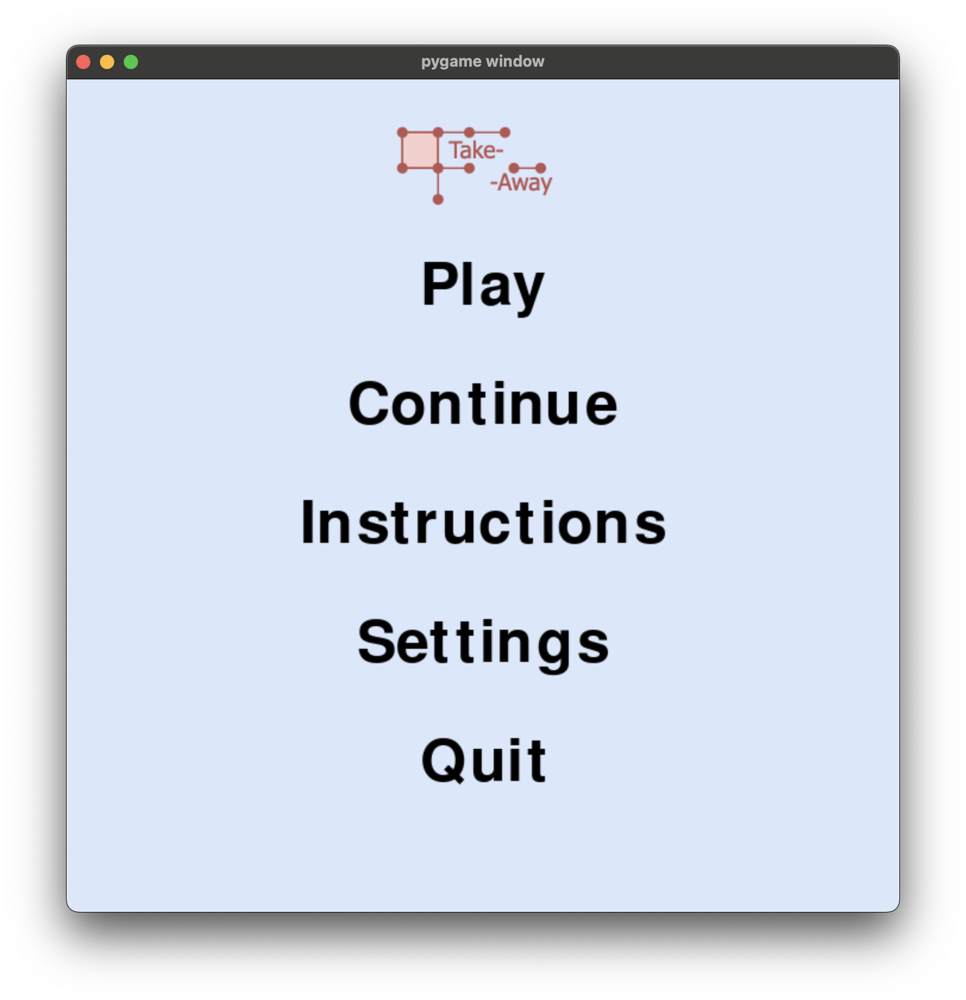

## Prerequisites
- Python 3.x
- Pygame library

## Files
- `GameStates.py`: Contains functions for managing game states and calculating Nim values.
- `Tripartite Graphs.py`: Provides functions for handling tripartite graphs and calculating their Nim values.
- `TakeAway.py`: Manages the game interface and user interactions.

## Setup
1. Clone the repository:
    ```sh
    git clone https://github.com/NelsonXunic/TakeAwayHypergraphs.git
    ```
2. Navigate to the project directory:
    ```sh
    cd TakeAwayHypergraphs
    ```
3. Install the required dependencies:
    ```sh
    pip install -r requirements.txt
    ```

## Usage
1. Run the game:
    ```sh
    python TakeAway.py
    ```
2. Follow the on-screen instructions to play the game.
   ### Starting the Game
   1. Run the game using the command above.
   2. The main menu will appear. Click "Play" to start a new game.

    ### Customizing the Palette
    1. From the main menu, click "Settings".
    2. Select a color palette or customize your own.
    
    ### Saving and Loading Game State
    1. During the game, click "Save Game" to save the current state.
    2. To load a saved game, click "Continue" from the main menu.

### Screenshots





## Contributing
1. Fork the repository.
2. Create a new branch:
    ```sh
    git checkout -b feature-branch
    ```
3. Make your changes and commit them:
    ```sh
    git commit -m "Description of changes"
    ```
4. Push to the branch:
    ```sh
    git push origin feature-branch
    ```
5. Open a pull request.
